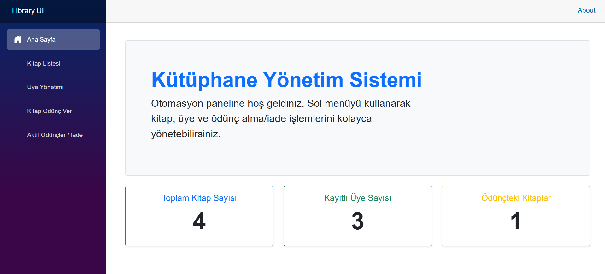
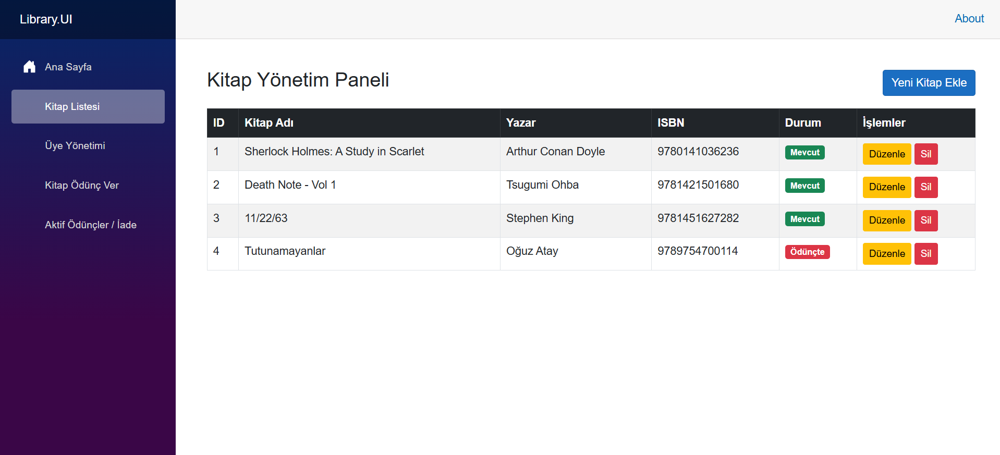
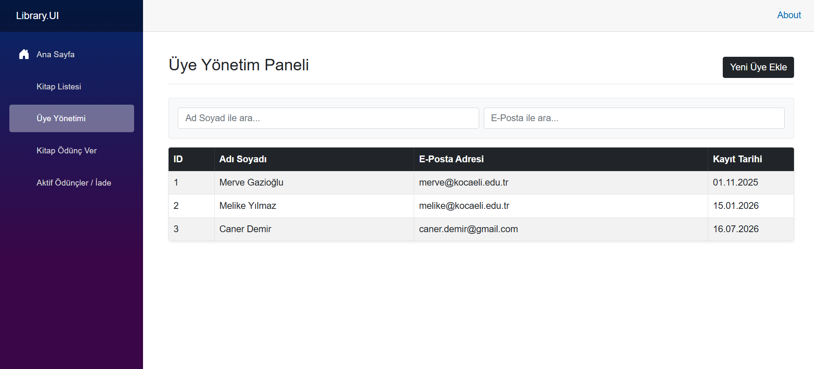
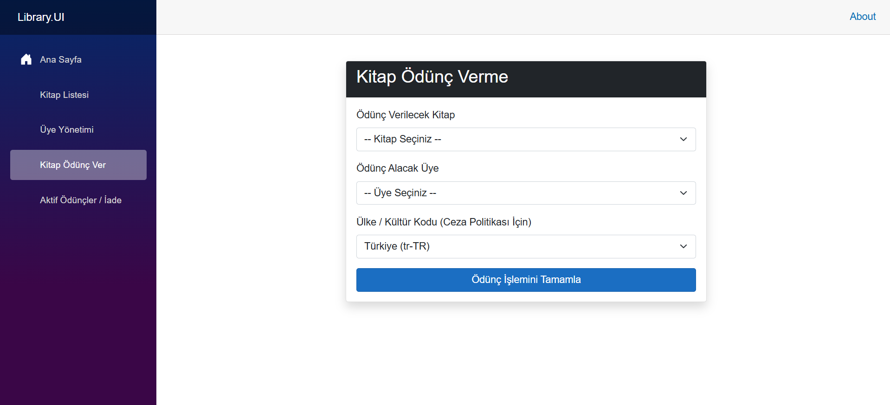
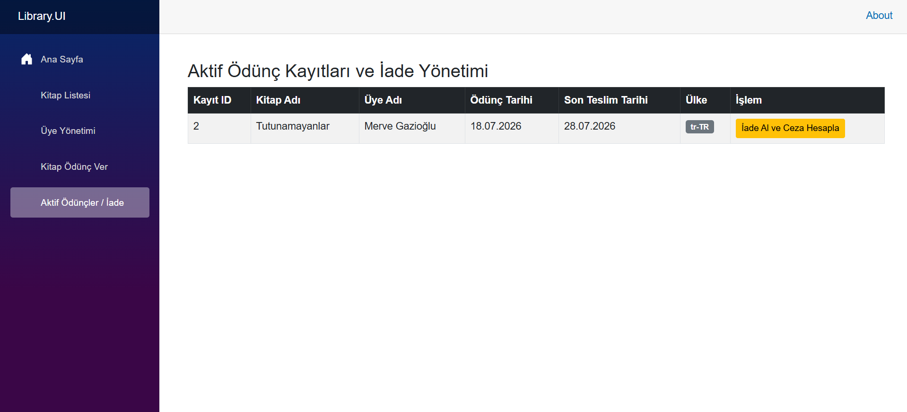

# 📚 Library Automation System (Kütüphane Otomasyon Sistemi)

<div align="center">


**Ülkeye özel iş günü / resmi tatil hesaplaması yapan dinamik ceza motoruna sahip, katmanlı mimari ile geliştirilmiş RESTful Kütüphane Otomasyon API'si ve Blazor Server tabanlı yönetim arayüzü.**

</div>

---

## 📖 İçindekiler

- [Proje Hakkında](#-proje-hakkında)
- [Kullanılan Teknolojiler ve Araçlar](#️-kullanılan-teknolojiler-ve-araçlar)
- [Proje Mimari Yapısı](#proje-mimari-yapisi)
- [Öne Çıkan İş Kuralları](#one-cikan-is-kurallari)
- [Kurulum ve Çalıştırma Adımları](#-kurulum-ve-çalıştırma-adımları)
- [API Endpoint'leri](#-api-endpointleri)
- [Kullanıcı Arayüzü (UI)](#kullanici-arayuzu-ui)
- [Testlerin Çalıştırılması](#-testlerin-çalıştırılması)
---

## 🎯 Proje Hakkında

Bu proje, bir kütüphanenin **kitap**, **üye** ve **ödünç alma/iade** süreçlerini yönetmek amacıyla geliştirilmiş, **.NET 8** tabanlı bir Web API stajyer projesidir. Sistemin en dikkat çekici bileşeni, ülkeye özgü hafta sonu ve resmi tatil takvimlerini dikkate alarak gecikme cezasını hesaplayan **`PenaltyFeeCalculator`** servisidir. Proje ayrıca, API ile tam entegre çalışan **Blazor Server** tabanlı bir yönetim paneli (**Library.UI**) içerir.

Proje; **SOLID prensipleri**, **Dependency Injection (IoC)** ve **N-Tier (katmanlı) mimari** kullanılarak sürdürülebilir, test edilebilir ve genişletilebilir bir yapıda tasarlanmıştır.

---

## 🛠️ Kullanılan Teknolojiler ve Araçlar

| Kategori | Teknoloji |
|---|---|
| **Framework** | .NET 8 (ASP.NET Core Web API) |
| **UI** | Blazor Server (Interactive Server Components), Bootstrap 5 |
| **ORM** | Entity Framework Core 8 (Code-First) |
| **Veritabanı** | SQL Server / LocalDB |
| **API Dokümantasyonu** | Swagger / OpenAPI |
| **Test Framework'ü** | xUnit |
| **Konfigürasyon** | Custom `ConfigurationSectionHandler` (App.config XML) |
| **Tasarım Desenleri** | SOLID (SRP, DIP), Dependency Injection, Repository/Entity Pattern, Service Pattern |

---

<a name="proje-mimari-yapisi"></a>
## 🏗️ Proje Mimari Yapısı

Proje, sorumlulukların net şekilde ayrıldığı bir **Layered Monolith (N-Tier) Architecture** üzerine kuruludur:

```
LibrarySolution/
│
├── Library.Core/                  # Entity (Domain Model) ve DTO katmanı
│   ├── Book.cs / BookDto.cs
│   ├── Member.cs / MemberDto.cs
│   └── BorrowRecord.cs / BorrowRecordDto.cs
│
├── Library.Business/              # İş kuralları / servis katmanı
│   ├── IPenaltyFeeCalculator.cs   # Ceza hesaplama sözleşmesi (interface)
│   └── PenaltyFeeCalculator.cs    # Ceza hesaplama iş mantığı (SRP)
│
├── Library.Data/                  # Veri erişim katmanı (EF Core)
│   └── LibraryDbContext.cs        # DbContext, ilişkiler, seed data
│
├── Library.API/                   # Sunum / API katmanı
│   └── Controllers/
│       ├── BooksController.cs     # Kitap CRUD işlemleri
│       ├── MembersController.cs   # Üye CRUD işlemleri
│       ├── BorrowController.cs    # Ödünç alma / iade işlemleri
│       └── PenaltyController.cs   # Ceza hesaplama endpoint'i
│
├── Library.UI/                    # Blazor Server yönetim paneli
│   ├── Components/
│   │   ├── Layout/                # MainLayout, NavMenu
│   │   ├── Pages/                 # Home, Books, Members, Borrow, ActiveBorrows
│   │   └── Shared/                # ToastContainer (bildirim bileşeni)
│   └── Services/                  # BookService, MemberService, BorrowService, ToastService
│
├── LibraryApplication/            # Konsol tabanlı bağımsız çalıştırma (Program.cs)
│   └── Program.cs
│
├── LibrarySolution.Tests/         # Birim testler
│   └── PenaltyFeeCalculatorTests.cs
│
└── App.config                     # Ülke bazlı ceza/tatil/hafta sonu konfigürasyonu
```

### Katmanlar Arası Bağımlılık Yönü

```
Library.UI  →  Library.API  →  Library.Business  →  Library.Core
                    ↓                                     ↑
              Library.Data  ───────────────────────────┘
```

> **Dependency Inversion Principle (DIP)** gereği, `Library.API` katmanı `PenaltyFeeCalculator` somut sınıfına değil, `IPenaltyFeeCalculator` soyutlamasına bağımlıdır. Bağımlılık, `Program.cs` üzerinde IoC Container aracılığıyla enjekte edilir. Aynı şekilde `Library.UI`, servis arayüzleri (`IBookService`, `IMemberService`, `IBorrowService`, `IToastService`) üzerinden çalışır ve API'ye doğrudan değil `HttpClient` soyutlaması aracılığıyla bağlanır.

---

<a name="one-cikan-is-kurallari"></a>
## ⚖️ Öne Çıkan İş Kuralları

### İş Günü / Resmi Tatil Hesaplama Mantığı

`PenaltyFeeCalculator`, iki tarih arasındaki **gecikme süresini gerçek iş günü sayısına** göre hesaplar. Hesaplamada şu adımlar izlenir:

1. **Ülke Konfigürasyonu Bulma** — `countryCode` parametresine (`tr-TR`, `ar-AE` vb.) göre `App.config` içinden ilgili ülke ayarları (`Currency`, `DailyPenaltyFee`, `PenaltyAppliesAfter`, `WeekendList`, `HolidayList`) okunur.
2. **Kültüre Duyarlı Tarih Ayrıştırma** — Girilen tarihler, ülkenin `CultureInfo` bilgisine göre `DateTime`'a çevrilir; geçersiz formatlarda hata döner.
3. **İş Günü Sayımı** — Başlangıç ile bitiş tarihi arasındaki her gün tek tek gezilir:
   - Ülkeye özel **hafta sonu günleri** atlanır (örn. Türkiye'de Cumartesi/Pazar, BAE'de Cuma/Cumartesi).
   - Ülkeye özel **resmi tatil listesindeki** günler atlanır.
   - Kalan günler **iş günü** olarak sayılır.
4. **Ceza Eşiği Kontrolü** — Hesaplanan iş günü sayısı, `PenaltyAppliesAfter` (izinli gün sayısı) değerinden küçük veya eşitse ceza **0.00** olarak döner.
5. **Ceza Tutarı Hesaplama** — Eşik aşıldığında, aşan gün sayısı × `DailyPenaltyFee` formülüyle toplam ceza hesaplanır ve ülkenin para birimiyle (`TRY`, `AED` vb.) birlikte döndürülür.

#### Örnek Ülke Kuralları (`App.config`)

| Ülke | Para Birimi | Günlük Ceza | İzinli Gün | Hafta Sonu |
|---|---|---|---|---|
| 🇹🇷 Türkiye (`tr-TR`) | TRY | 5,25 | 3 gün | Cumartesi, Pazar |
| 🇦🇪 BAE (`ar-AE`) | AED | 8.00 | 4 gün | Cuma, Cumartesi |

### Diğer İş Kuralları

- Bir kitap **yalnızca müsaitse (`IsAvailable = true`)** ödünç verilebilir; ödünç verildiğinde durumu otomatik güncellenir.
- İade işleminde ceza otomatik hesaplanır ve `BorrowRecord.ComputedPenaltyFee` alanına yazılır.
- Başlangıç tarihi bitiş tarihinden ileride olamaz; aksi durumda anlamlı bir hata mesajı döner.

### Kullanıcı Arayüzü (UX) Kuralları

- Tüm API çağrıları sırasında **yükleniyor göstergesi** (spinner) gösterilir.
- Liste boşsa kullanıcıya **"Kayıt bulunamadı"** mesajı gösterilir.
- Ekleme / güncelleme / silme / ödünç verme / iade işlemleri sonucunda **toast bildirimi** (başarı veya hata) gösterilir.
- API'ye ulaşılamadığı durumlarda kullanıcıya boş liste yerine **"Tekrar Dene"** seçenekli anlamlı bir hata mesajı gösterilir.

---

## 🚀 Kurulum ve Çalıştırma Adımları

### Ön Gereksinimler

- [.NET 8 SDK](https://dotnet.microsoft.com/download/dotnet/8.0)
- SQL Server LocalDB (Visual Studio ile birlikte gelir) veya tam SQL Server
- (Opsiyonel) Visual Studio 2022 / VS Code / Rider

### 1️⃣ Projeyi Klonlayın

```bash
git clone https://github.com/<kullanici-adiniz>/library-automation-system.git
cd library-automation-system
```

### 2️⃣ Bağımlılıkları Yükleyin

```bash
dotnet restore
```

### 3️⃣ Bağlantı Cümlesini (Connection String) Ayarlayın

`Library.API/appsettings.json` içine LocalDB bağlantınızı ekleyin:

```json
{
  "ConnectionStrings": {
    "DefaultConnection": "Server=(localdb)\\mssqllocaldb;Database=LibraryAutomationDb;Trusted_Connection=True;MultipleActiveResultSets=true"
  }
}
```

### 4️⃣ EF Core Migration Oluşturun ve Veritabanını Güncelleyin

```bash
# EF Core CLI aracı yüklü değilse
dotnet tool install --global dotnet-ef

# Migration oluşturma
dotnet ef migrations add InitialCreate --project Library.Data --startup-project Library.API

# Veritabanını migration'a göre güncelleme (seed data dahil oluşturulur)
dotnet ef database update --project Library.Data --startup-project Library.API
```

### 5️⃣ API'yi Çalıştırın

```bash
dotnet run --project Library.API
```

API ayağa kalktıktan sonra Swagger arayüzüne şu adresten ulaşabilirsiniz:

```
https://localhost:{port}/swagger
```

### 6️⃣ UI Panelini Çalıştırın

`Library.UI/appsettings.json` içindeki `ApiSettings:BaseUrl` değerinin, 5. adımda ayağa kalkan API adresiyle eşleştiğinden emin olun:

```json
{
  "ApiSettings": {
    "BaseUrl": "https://localhost:{api-port}/"
  }
}
```

Ardından UI projesini ayrı bir terminalde çalıştırın:

```bash
dotnet run --project Library.UI
```

Tarayıcıda açılan adresten (`https://localhost:{ui-port}`) yönetim paneline erişebilirsiniz.

### (Opsiyonel) Konsol Uygulamasını Çalıştırma

`PenaltyFeeCalculator` mantığını API'siz, doğrudan komut satırı (CLI) üzerinden bağımsız test etmek isterseniz projeyi derleyip üretilen yürütülebilir dosyayı (`.exe`) parametrelerle çalıştırabilirsiniz:

```bash
# 1. Projeyi derleyin
dotnet build LibraryApplication

# 2. Üretilen .exe dosyasını parametrelerle çalıştırın
.\LibraryApplication\bin\Debug\net8.0\LibraryApplication.exe tr-TR 23.11.2009 01.12.2009
```

---

## 🔌 API Endpoint'leri

### 📗 Books — `/api/books`

| Metot | Endpoint | Açıklama |
|---|---|---|
| `GET` | `/api/books` | Tüm kitapları listeler |
| `GET` | `/api/books/{id}` | ID'ye göre kitap detayı getirir |
| `POST` | `/api/books` | Yeni kitap ekler |
| `PUT` | `/api/books/{id}` | Kitap bilgilerini günceller |
| `DELETE` | `/api/books/{id}` | Kitabı siler |

**Örnek İstek — `POST /api/books`**
```json
{
  "title": "1984",
  "author": "George Orwell",
  "isbn": "9780451524935",
  "isAvailable": true
}
```

### 👤 Members — `/api/members`

| Metot | Endpoint | Açıklama |
|---|---|---|
| `GET` | `/api/members` | Tüm üyeleri listeler |
| `POST` | `/api/members` | Yeni üye ekler |

**Örnek İstek — `POST /api/members`**
```json
{
  "fullName": "Ahmet Yılmaz",
  "email": "ahmet@example.com"
}
```

### 🔄 Borrow — `/api/borrow`

| Metot | Endpoint | Açıklama |
|---|---|---|
| `POST` | `/api/borrow` | Kitap ödünç verme işlemi başlatır |
| `POST` | `/api/borrow/{id}/return` | Kitabı iade eder ve gecikme cezasını hesaplar |
| `GET` | `/api/borrow/active` | İade edilmemiş aktif ödünç kayıtlarını listeler |

**Örnek İstek — `POST /api/borrow`**
```json
{
  "bookId": 1,
  "memberId": 2,
  "countryCode": "tr-TR"
}
```

**Örnek Cevap**
```json
{
  "message": "Kitap başarıyla ödünç verildi.",
  "recordId": 5,
  "teslimTarihi": "2026-07-27T14:30:00"
}
```

**Örnek Cevap — `POST /api/borrow/{id}/return`**
```json
{
  "message": "Kitap başarıyla iade alındı.",
  "iadeTarihi": "2026-08-02T09:15:00",
  "cezaDurumu": "26,25 TRY"
}
```

### 💰 Penalty — `/api/penalty`

| Metot | Endpoint | Açıklama |
|---|---|---|
| `GET` | `/api/penalty/calculate` | Ülke kodu ve tarih aralığına göre ceza tutarını hesaplar |

**Örnek İstek**
```
GET /api/penalty/calculate?countryCode=tr-TR&startDate=16.11.2009&endDate=30.11.2009
```

**Örnek Cevap**
```json
{
  "feeResult": "26,25 TRY"
}
```

**Hata Durumu Örneği**
```json
"Error: Country configuration not found."
```

---

<a name="kullanici-arayuzu-ui"></a>
## 🖥️ Kullanıcı Arayüzü (UI)

`Library.UI` projesi, API'nin tüm işlevlerini kullanıcı dostu bir Blazor Server paneli üzerinden sunar. Panel; yükleniyor göstergeleri, boş liste mesajları, başarı/hata toast bildirimleri ve anlamlı hata mesajlarıyla desteklenmiştir.

### 🏠 Ana Sayfa

Toplam kitap, üye ve ödünçteki kitap sayısını özetleyen genel bakış ekranı.



### 📗 Kitap Yönetim Paneli

Kitapların listelendiği, satır içi düzenlenebildiği, eklenip silinebildiği ekran.



### 👤 Üye Yönetim Paneli

Üye ekleme formu ve ad/e-posta bazlı canlı arama filtresi içeren ekran.



### 🔄 Kitap Ödünç Verme

Müsait kitap ve kayıtlı üye seçilerek, ülke/ceza politikasına göre ödünç verme işleminin yapıldığı form.



### 📋 Aktif Ödünçler / İade

Aktif ödünç kayıtlarının listelendiği ve "İade Al ve Ceza Hesapla" butonuyla iade + ceza hesaplama işleminin tek adımda yapıldığı ekran.



---

## 🧪 Testlerin Çalıştırılması

Proje, `PenaltyFeeCalculator` servisinin iş kurallarını doğrulayan kapsamlı **xUnit** birim testleri içerir (eşik değer, hafta sonu geçişi, resmi tatil hariç tutma, geçersiz ülke kodu, tarih sıralama hataları vb. senaryolar dahil).

### Tüm Testleri Çalıştırma

```bash
dotnet test
```

### Belirli Bir Test Projesini Çalıştırma

```bash
dotnet test LibrarySolution.Tests/LibrarySolution.Tests.csproj
```

### Detaylı Çıktı ile Çalıştırma

```bash
dotnet test --logger "console;verbosity=detailed"
```

**Kapsanan Test Senaryolarından Bazıları:**

| Test | Senaryo |
|---|---|
| `Calculate_TR_ThresholdValue_ReturnsZeroFee` | İzinli gün sınırında ceza uygulanmaz |
| `Calculate_TR_OneDayPenalty_ReturnsCorrectFee` | Eşik aşıldığında doğru ceza hesaplanır |
| `Calculate_TR_WeekendTransition_CountsBusinessDaysCorrectly` | Hafta sonu geçişlerinde iş günü doğru sayılır |
| `Calculate_TR_WithHoliday_ExcludesHolidayCorrectly` | Resmi tatiller hesaplamadan hariç tutulur |
| `Calculate_AE_DifferentWeekend_CalculatesCorrectly` | Farklı ülke hafta sonu kuralı doğru işler |
| `Calculate_InvalidCountryCode_ReturnsErrorMessage` | Tanımsız ülke kodunda hata mesajı döner |
| `Calculate_StartDateLaterThanEndDate_ReturnsErrorMessage` | Geçersiz tarih sıralamasında hata döner |

---
